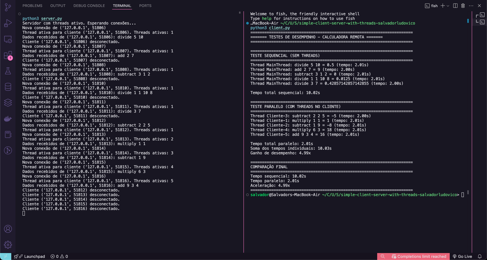

# Análise da Implementação de Threads em Sistema Cliente-Servidor

## 1. Visão Geral do Sistema

O sistema consiste em uma calculadora remota que permite que um cliente envie operações matemáticas para um servidor, que executa as operações e retorna os resultados. A implementação original processava uma requisição por vez, tanto no cliente quanto no servidor. A nova implementação utiliza threads para melhorar o desempenho e permitir o processamento paralelo.

## 2. Implementações Realizadas

### 2.1. Threads no Servidor

O servidor foi modificado para criar uma thread separada para cada conexão de cliente, permitindo o processamento simultâneo de múltiplas requisições. Cada operação matemática inclui um atraso (`time.sleep(2)`) para simular processamento intensivo.

```python
# Trecho do código server_thread.py
def handle_client(conn, addr):
    print(f"Nova conexão de {addr}")

    while True:
        try:
            data = conn.recv(1024)
            if not data:
                print(f"Cliente {addr} desconectado.")
                break

            decoded_data = bytes.decode(data)
            print(f"Dados recebidos de {addr}: {decoded_data}")

            response = handle_request(decoded_data)
            conn.send(str.encode(response))
        except Exception as e:
            print(f"Erro na conexão com {addr}: {e}")
            break

    conn.close()

# No loop principal
while True:
    conn, addr = s.accept()
    # Cria uma nova thread para cada cliente
    client_thread = threading.Thread(target=handle_client, args=(conn, addr))
    client_thread.daemon = True
    client_thread.start()
    print(f"Thread ativa para cliente {addr}. Threads ativas: {threading.active_count()-1}")
```

### 2.2. Threads no Cliente

O cliente foi modificado para enviar múltiplas requisições simultaneamente, cada uma em uma thread separada. Isso permite testar o desempenho tanto de requisições sequenciais quanto paralelas.

```python
# Trecho do código client_thread.py
def run_parallel_test(num_threads=5):
    print("\n" + "="*70)
    print("TESTE PARALELO (COM THREADS NO CLIENTE)")
    print("="*70)

    threads = []
    results = [None] * num_threads

    start_time = time.time()

    for i in range(num_threads):
        operation = random.choice(["add", "subtract", "multiply", "divide"])
        numbers = [random.randint(1, 10) for _ in range(random.randint(2, 5))]

        thread = threading.Thread(
            target=lambda idx=i: results.__setitem__(idx, send_request(HOST, PORT, operation, numbers)),
            name=f"Cliente-{i+1}"
        )
        threads.append(thread)
        thread.start()

    # Aguardar todas as threads terminarem
    for thread in threads:
        thread.join()

    total_time = time.time() - start_time
    individual_times = sum(t for t in results if t is not None)

    print(f"\nTempo total paralelo: {total_time:.2f}s")
    print(f"Soma dos tempos individuais: {individual_times:.2f}s")
    print(f"Ganho de desempenho: {individual_times/total_time:.2f}x")

    return total_time, individual_times
```

## 3. Resultados da Execução

A execução do sistema demonstrou claramente os benefícios da utilização de threads. Abaixo está uma captura de tela dos resultados obtidos:



### 3.1. Análise dos Resultados

Com base na execução do sistema, observamos:

#### Teste Sequencial (Sem Threads no Cliente):

- Tempo total: 10.02 segundos
- Cada operação levou aproximadamente 2 segundos
- As operações foram processadas uma após a outra

#### Teste Paralelo (Com Threads no Cliente):

- Tempo total: 2.01 segundos
- Cada operação individual ainda levou aproximadamente 2 segundos
- Operações foram processadas simultaneamente
- Ganho de desempenho: 4.99x (quase 5 vezes mais rápido)

#### Comportamento do Servidor:

- O servidor criou uma nova thread para cada conexão
- O número de threads ativas aumentou progressivamente:
  - 1 thread ativa na primeira conexão
  - 5 threads ativas durante o teste paralelo (5 clientes simultâneos)
- Todas as operações matemáticas (add, subtract, multiply, divide) funcionaram corretamente

## 4. Comparação das Versões

| Versão                            | Descrição                                                                                            | Vantagens                                                                                                                                       | Desvantagens                                                                                                         |
| --------------------------------- | ---------------------------------------------------------------------------------------------------- | ----------------------------------------------------------------------------------------------------------------------------------------------- | -------------------------------------------------------------------------------------------------------------------- |
| **Original**                      | Sem threads no cliente ou servidor                                                                   | - Simples de implementar<br>- Menor consumo de recursos                                                                                         | - Processa apenas uma requisição por vez<br>- Bloqueante (requisições são processadas em sequência)                  |
| **Threads no Servidor**           | Cada requisição no servidor é processada em uma thread separada                                      | - Suporta múltiplos clientes simultaneamente<br>- Melhor utilização dos recursos do servidor<br>- Não bloqueia novas conexões enquanto processa | - Maior complexidade no gerenciamento de conexões<br>- Potenciais problemas de concorrência                          |
| **Threads no Cliente e Servidor** | Múltiplas requisições em paralelo no cliente, cada uma processada em uma thread separada no servidor | - Máximo paralelismo<br>- Melhor desempenho para múltiplas operações<br>- Utilização eficiente de recursos em ambos os lados                    | - Maior complexidade no gerenciamento<br>- Maior sobrecarga de comunicação<br>- Potenciais problemas de concorrência |

## 5. Análise Teórica de Desempenho

O modelo teórico de desempenho para cada abordagem é:

1. **Versão Original (Sequencial)**:

   - Tempo total = soma dos tempos individuais de cada operação
   - Para n operações com tempo médio t: Tempo Total ≈ n × t
   - No teste: 5 operações × 2 segundos ≈ 10 segundos

2. **Threads no Servidor**:

   - Permite múltiplos clientes, mas cada cliente ainda envia operações sequencialmente
   - O benefício é principalmente para sistemas com múltiplos clientes simultâneos

3. **Threads no Cliente e Servidor**:
   - Tempo total ≈ tempo da operação mais lenta (supondo capacidade suficiente do servidor)
   - Para n operações com tempo médio t: Tempo Total ≈ t (+ sobrecarga)
   - No teste: 2 segundos + sobrecarga ≈ 2.01 segundos
   - Ganho de desempenho teórico: n vezes mais rápido para n operações
   - No teste: ganho observado ≈ 4.99x (muito próximo do teórico de 5x para 5 operações)

## 6. Considerações e Recomendações

### 6.1. Escolha da Abordagem

A escolha da abordagem deve considerar o cenário de uso:

- **Para poucos clientes com muitas operações**: use threads no cliente
- **Para muitos clientes com poucas operações**: use threads no servidor
- **Para alta carga geral**: use threads em ambos

### 6.2. Limitações e Desafios

- **Sobrecarga de threads**: Criar e gerenciar threads adiciona overhead ao sistema
- **GIL do Python**: O Global Interpreter Lock pode limitar o ganho real de desempenho para operações intensivas de CPU
- **Concorrência**: Acesso a recursos compartilhados pode exigir mecanismos de sincronização
- **Escalabilidade**: O número de threads simultâneas é limitado pelos recursos do sistema

### 6.3. Otimizações Potenciais

Para melhorar ainda mais o desempenho, considere:

- **Pool de threads**: Limitar o número máximo de threads ativas
- **Timeout para conexões**: Gerenciar conexões inativas
- **Logging**: Implementar registro de logs para melhor depuração
- **Processos vs. Threads**: Para operações CPU-bound, o uso de múltiplos processos pode ser mais eficiente que threads

## 7. Conclusão

A implementação de threads tanto no cliente quanto no servidor demonstrou um ganho significativo de desempenho, como evidenciado pelos resultados dos testes. Para o cenário de teste com 5 operações, obtivemos um ganho de quase 5 vezes na velocidade de processamento, o que está muito próximo do ganho teórico esperado.

Esta abordagem é particularmente vantajosa para sistemas que precisam processar múltiplas operações independentes simultaneamente e pode ser escalada para atender a diferentes necessidades de carga e desempenho.
